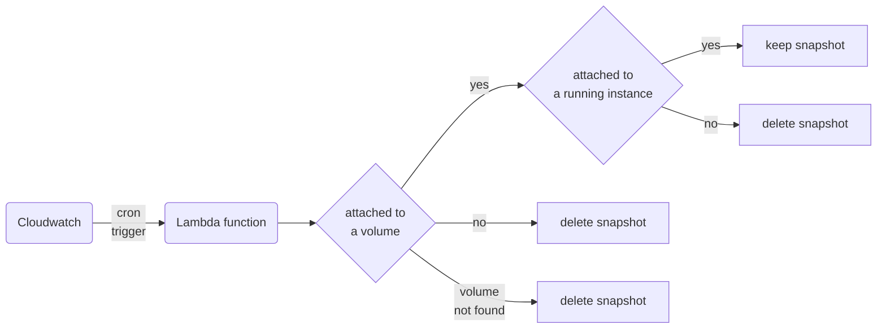

# Cloud Cost Optimization by Identifying Stale Resources

## Identifying Stale EBS Snapshots:
In this Lambda function, stale EBS snapshots that are not associated with a volume or the assciated volumes are not associated with active ec2 instance are identified and deleted to reduce cloud costs. 

## Flowchart:
